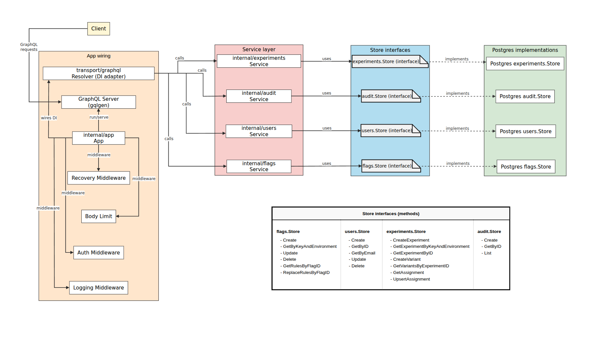
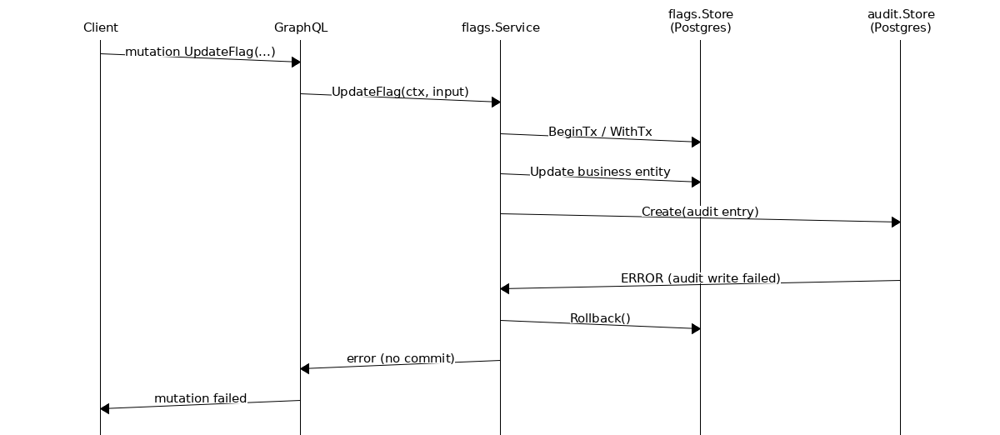
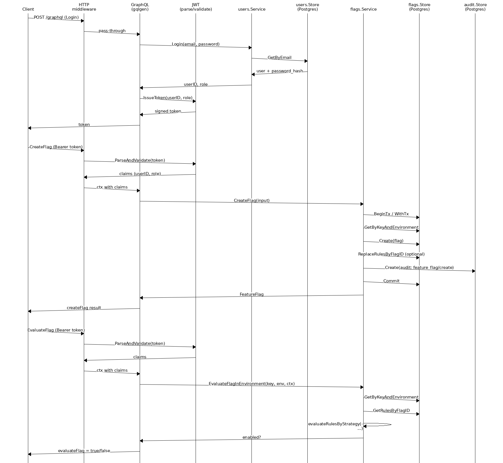

# Feature Flag & Experiment Management API

A production-oriented backend service for managing feature flags and A/B experiments, built in Go with GraphQL and PostgreSQL.

The project focuses on **clean architecture, deterministic behavior, strong testing discipline, and structured development workflow**, while also serving as a **real-world environment for learning and applying new technologies** (Go, GraphQL, PostgreSQL).

---

## At a glance

- Clean architecture with strict separation of transport, service, and repository layers  
- GraphQL API (schema-first via gqlgen) over HTTPS  
- Deterministic feature flag rollout (percentage + attribute-based)  
- Experiment management with stable user assignment  
- Fail-closed audit logging with transactional guarantees  
- End-to-end tested with real PostgreSQL (testcontainers)  
- Local + CI parity via scripts and GitHub Actions  
- Risk-based coverage policy with enforced multi-level gates (~90% achieved)

---

## Why this project exists

This project was built with three primary goals:

### 1. Engineering discipline

To design and implement a backend system with:

- clear architectural boundaries  
- deterministic behavior  
- explicit error handling  
- strong testability

### 2. Learning new technologies in a real context

The project intentionally uses:

- **Go** (idiomatic backend development, concurrency, strong typing)  
- **GraphQL (gqlgen)** (schema-first API design)  
- **PostgreSQL** (relational modeling, transactional consistency)

The goal was not just to "try" these technologies, but to **apply them in a realistic, structured system**.

### 3. Structured development workflow

The system was developed using a strict cycle:

#### PLAN → APPROVAL → IMPLEMENT → TEST → REVIEW

With:

- phased delivery  
- explicit review checkpoints  
- continuous validation through tests and CI

---

## System overview

The system provides:

### Feature Flags

- Create, update, delete flags  
- Enable/disable per environment (`dev`, `staging`, `prod`)  
- Rollout strategies:
  - Percentage-based (deterministic hashing)
  - Attribute-based (e.g. userId, email domain)

### Experiments (A/B testing)

- Define experiments with variants  
- Weighted distribution (e.g. 50/50, 90/10)  
- Deterministic user assignment  
- Persistent assignment storage

### Audit Logging

- Every critical mutation is recorded  
- Includes actor, action, and timestamp  
- Enforced as a **system invariant** (fail-closed)

### Authentication & Authorization

- JWT-based authentication  
- Role-based access control:
  - `admin`
  - `developer`
  - `viewer`

---

## Architecture at a glance

The system follows a layered architecture with strict separation of concerns:

- **Transport layer** → GraphQL (resolvers, middleware)  
- **Service layer** → business logic (flags, experiments, audit)  
- **Repository layer** → PostgreSQL access  
- **Database** → relational schema with transactional guarantees



---

## Selected behavioural flows

### Fail-closed audit semantics

Critical mutations use **fail-closed audit logic**:

- Business change and audit log are executed in the same transaction  
- If audit logging fails → transaction is rolled back  
- The system **never allows a state where data changes exist without audit trail**



---

### End-to-end request flows

The following diagram shows representative flows across the same stack:

- **Login**  
  - User lookup + password verification  
  - JWT token issued
- **CreateFlag (write path)**  
  - JWT validated in middleware  
  - Transactional write + audit logging  
  - Commit on success
- **EvaluateFlag (read/decision path)**  
  - Rules loaded from DB  
  - Deterministic evaluation in service layer  
  - Boolean result returned



---

## Engineering approach

### Clean architecture enforcement

- Transport layer depends only on service contracts  
- Service layer is independent of GraphQL and transport  
- Repository layer handles only persistence  
- No cross-layer leakage

### Coding discipline

- Small, focused functions (max ~23 lines)  
- Explicit error handling (typed errors, no hidden failures)  
- No global mutable state (unless safely controlled)  
- Idiomatic Go prioritized over abstraction

### Deterministic behavior

- Feature rollout uses hashing → stable results  
- Experiment assignment is repeatable  
- Tests do not rely on randomness

---

## Quality highlights

- Unit tests for all business logic  
- Integration tests with real PostgreSQL (testcontainers)  
- GraphQL tested end-to-end over HTTPS  
- Binary smoke tests (real compiled app)  
- Bash-based integration scenarios (config, error cases)  
- CI runs full suite on every push/PR

### Coverage policy (final)

- Global coverage: **~90%**  
- Enforced multi-tier gates:
  - Global threshold  
  - Per-file thresholds  
  - Function-level thresholds
- Coverage measured across **unit + integration tests combined**  
- Designed to prevent “fake coverage” (e.g. empty branches)

---

## Technology stack

- **Go** — core backend implementation  
- **GraphQL (gqlgen)** — schema-first API  
- **PostgreSQL** — persistence layer  
- **JWT** — authentication  
- **Docker / testcontainers** — integration testing  
- **GitHub Actions** — CI pipeline  
- **Bash scripts** — local/CI parity

---

## Project status

The project is **complete and fully reviewed**.

- All planned phases (1–5) finished  
- Core functionality implemented and tested  
- Production-oriented hardening completed  
- Coverage and quality gates stabilized

The project is now in **maintenance mode**:

- bug fixes  
- minor refinements  
- optional future extensions

---

## Testing

Run locally:

```bash
# Quick validation (fast)
./scripts/test_all_quick.sh

# Full suite (same as CI)
./scripts/test_all_full.sh
```

Coverage:

```bash
./scripts/coverage/test_coverage.sh
```

## Notes

This project is best understood as:

> A production-oriented engineering exercise focused on architecture, disciplined development workflow, and high-quality backend design — while intentionally learning and applying new technologies in a real system.

It is not just about building features, but about **how those features are designed, validated, and maintained**.